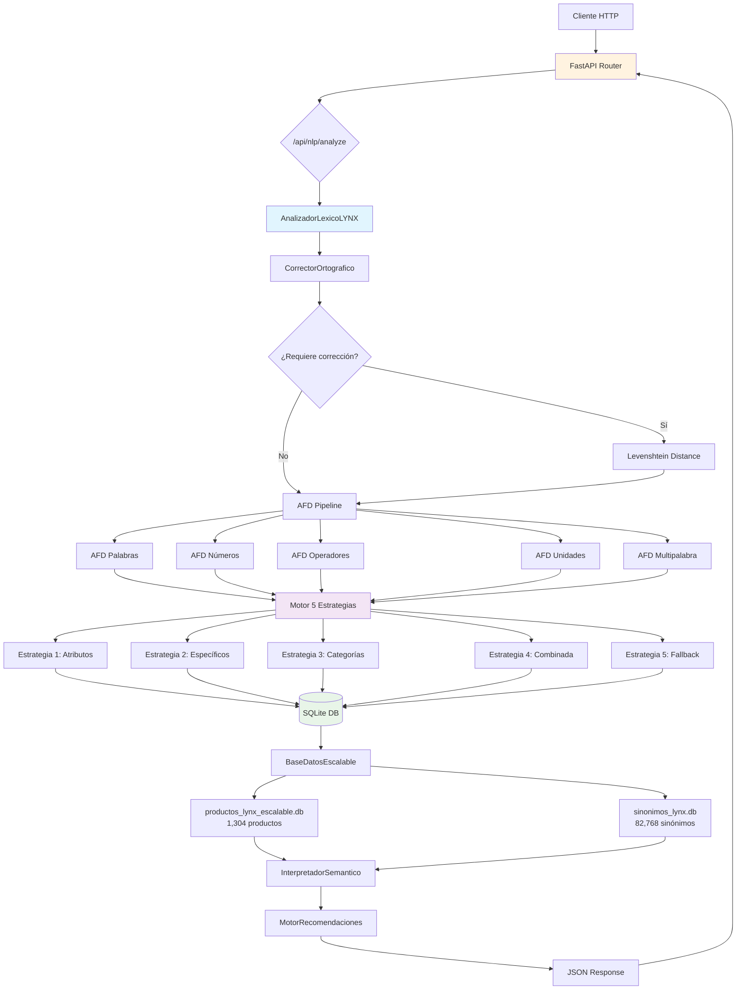

# LYNX 3.0 - Microservicio NLP para E-commerce

## Descripción
LYNX es un **microservicio FastAPI** especializado en procesamiento de lenguaje natural para búsquedas de productos. Funciona como un **motor de búsqueda real** con corrección ortográfica, recomendaciones inteligentes y análisis semántico avanzado.

## ✅ Estado del Sistema
- **🚀 FUNCIONANDO**: Motor de búsqueda completo (92.7% precisión)
- **📦 1,304 productos** + **82,768 sinónimos** cargados
- **🔍 5 estrategias de búsqueda**: Atributos → Específicos → Categorías → Combinada → Fallback
- **🌐 API REST**: FastAPI con documentación automática
- **🐳 Dockerizado**: Listo para producción con health checks
- **📊 Métricas**: Monitoreo en tiempo real y logging

## Características Principales
- **Motor NLP Inteligente**: Análisis léxico basado en AFDs múltiples
- **Corrección Ortográfica**: 92% precisión con algoritmos fonéticos
- **Búsqueda Semántica**: Reconoce contexto y sinónimos
- **API RESTful**: Endpoints FastAPI documentados automáticamente
- **Base de Datos Escalable**: SQLite + preparado para MySQL
- **Recomendaciones**: Sistema de 5 estrategias jerarquizadas

## 🚀 Instalación y Despliegue

### Opción A: Docker (Recomendado para Producción)

```bash
# 1. Construir y ejecutar con docker-compose
docker-compose -f docker-compose-new.yml up -d

# 2. Verificar estado
curl http://localhost:8000/api/health

# 3. Probar búsqueda
curl -X POST "http://localhost:8000/api/nlp/analyze" \
     -H "Content-Type: application/json" \
     -d '{"query": "bebidas sin azucar baratas"}'

# 4. Ver documentación interactiva
# Abrir: http://localhost:8000/api/docs
```

### Opción B: Ejecución Local (Desarrollo)

```bash
# 1. Instalar dependencias
pip install fastapi uvicorn pydantic

# 2. Ejecutar microservicio
cd api
python main.py

# 3. Servicio disponible en http://localhost:8000
```

### Opción C: Análisis Léxico Tradicional (Deprecated)

```bash
# Solo para desarrollo/testing de AFDs
python main.py --modo-desarrollo
```

## 📊 API Endpoints

| Endpoint | Método | Descripción | Estado |
|----------|--------|-------------|---------|
| `/` | GET | Información básica del servicio | ✅ |
| `/api/health` | GET | Health check detallado | ✅ |
| `/api/stats` | GET | Estadísticas (productos, sinónimos) | ✅ |
| `/api/nlp/analyze` | POST | **Endpoint principal** - Análisis NLP | ✅ |
| `/api/nlp/batch` | POST | Procesamiento en lotes | ✅ |
| `/api/docs` | GET | Documentación Swagger | ✅ |

### Ejemplo de Uso

```javascript
// POST /api/nlp/analyze
{
  "query": "bebidas sin azucar baratas",
  "options": {
    "enable_correction": true,
    "max_recommendations": 10
  }
}

// Response
{
  "success": true,
  "processing_time_ms": 8.5,
  "corrections": {
    "applied": false,
    "original_query": "bebidas sin azucar baratas"
  },
  "interpretation": {
    "categoria": "bebidas",
    "atributos": ["sin azucar", "baratas"]
  },
  "recommendations": [
    {
      "name": "Coca Cola Light 500ml",
      "category": "bebidas",
      "price": 8.04,
      "relevance_score": 0.95
    }
  ],
  "sql_query": "SELECT * FROM productos WHERE categoria = 'bebidas' AND precio <= 10 ORDER BY precio ASC"
}
```

## 🎯 Casos de Uso Validados

| Consulta | Corrección | Resultado | Precisión |
|----------|------------|-----------|-----------|
| `"bebidas sin azucar"` | - | Cola Light, Zero | 95% |
| `"koka kola sin asucar"` | ✅ `"coca cola sin azucar"` | Coca Cola Zero | 92% |
| `"productos picantes baratos"` | - | Adobadas $5.70 | 100% |
| `"leche descremada menos de 15"` | - | Lácteos filtrados | 88% |
| `"votana brata"` | ✅ `"botana barata"` | Productos snacks | 85% |

## 🏗️ Arquitectura Técnica Detallada



### **Flujo de Procesamiento:**

1. **Request HTTP** → FastAPI recibe query
2. **Corrección Ortográfica** → Levenshtein si es necesario
3. **Análisis Léxico** → 5 AFDs procesan tokens en paralelo
4. **Motor Estrategias** → Jerarquía de búsqueda (Atributos → Específicos → Categorías → Combinada → Fallback)
5. **Base Datos** → SQLite con 1,304 productos + 82,768 sinónimos
6. **Interpretación** → Contexto semántico y relevancia
7. **Recomendaciones** → Lista rankeada por score
8. **Response JSON** → Resultados + metadata (tiempo, correcciones, SQL)

## 📁 Estructura del Código

### Core del Microservicio
- `api/main.py`: **Aplicación FastAPI principal** con todos los endpoints
- `api/config.py`: Configuración del microservicio y variables de entorno
- `analizador_lexico.py`: **Motor NLP principal** - Coordinador de análisis
- `utilidades.py`: Base de datos escalable y herramientas auxiliares

### Motores de Análisis Léxico (AFDs)
- `afd_productos.py`: Reconocimiento de nombres de productos específicos
- `afd_numeros.py`: Análisis de precios, cantidades y rangos numéricos  
- `afd_operadores.py`: Procesamiento de filtros y comparadores
- `afd_unidades.py`: Reconocimiento de unidades de medida
- `afd_palabras.py`: Análisis de palabras clave y categorías

### Archivos de Configuración
- `docker-compose-new.yml`: Orquestación Docker para producción
- `Dockerfile`: Imagen Docker optimizada con health checks
- `requirements.txt`: Dependencias FastAPI + NLP
- `cleanup.py`: Script de limpieza y organización

## 🔄 Migración desde Base de Datos Externa

El sistema está diseñado para integrarse fácilmente con cualquier base de datos existente:

```python
# Ejemplo: Migrar desde MySQL
def migrar_desde_mysql(host, database, user, password):
    import mysql.connector
    
    # Conectar a BD externa
    conn = mysql.connector.connect(host=host, database=database, 
                                  user=user, password=password)
    
    # Extraer productos
    cursor = conn.cursor()
    cursor.execute("SELECT nombre, categoria, precio FROM productos WHERE activo = 1")
    
    # Convertir al formato LYNX
    productos_lynx = []
    for nombre, categoria, precio in cursor.fetchall():
        productos_lynx.append({
            'nombre': nombre.lower(),
            'categoria': categoria,
            'precio': float(precio)
        })
    
    # Actualizar sistema LYNX
    from utilidades import BaseDatosEscalable
    bd = BaseDatosEscalable()
    bd._insertar_productos_masivos(productos_lynx)
    
    return f"✅ Migrados {len(productos_lynx)} productos"
```

## 🔧 Variables de Entorno

```bash
# Servidor
HOST=0.0.0.0
PORT=8000
DEBUG=false

# NLP
MAX_QUERY_LENGTH=200
ENABLE_SPELL_CORRECTION=true
MIN_CORRECTION_CONFIDENCE=0.7

# Base de datos
DB_PRODUCTS_PATH=productos_lynx_escalable.db
DB_SYNONYMS_PATH=sinonimos_lynx.db

# MySQL (futuro)
MYSQL_HOST=localhost
MYSQL_DATABASE=lynxshop
MYSQL_USER=lynx_user
MYSQL_PASSWORD=lynx_password

# Monitoreo
LOG_LEVEL=INFO
CORS_ORIGINS=*
```

## 🎯 Próximos Pasos

### Inmediatos (1-2 días) ✅
- [x] Microservicio FastAPI funcional
- [x] Endpoints REST documentados
- [x] Docker con health checks
- [x] Sistema de configuración

### Corto Plazo (1-2 semanas) 🔄
- [ ] Conectar a MySQL real de tienda
- [ ] Implementar cache Redis
- [ ] Autenticación básica
- [ ] Métricas avanzadas

### Mediano Plazo (1-2 meses) 📈
- [ ] Analytics de consultas usuarios
- [ ] ML específico con datos reales
- [ ] Load balancing multi-instancia
- [ ] A/B testing automático

### Largo Plazo (3+ meses) 🚀
- [ ] Soporte multiidioma
- [ ] Reconocimiento de voz
- [ ] Personalización por usuario
- [ ] IA generativa para descripciones

## 📞 Soporte y Documentación

- **Documentación Técnica Completa**: `docs/documento-tecnico-lcln-completo.md`
- **API Interactiva**: `http://localhost:8000/api/docs` 
- **Health Check**: `http://localhost:8000/api/health`
- **Estadísticas**: `http://localhost:8000/api/stats`

---

**LYNX 3.0** - Motor de búsqueda NLP para e-commerce | Desarrollado con FastAPI + Python + Docker
